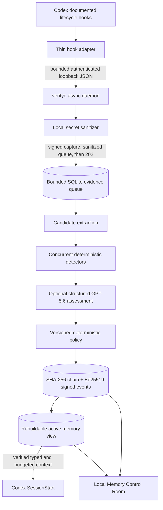

# Verity Cordon

**A tamper-evident memory firewall for Codex.**

**Verifiable memory. Revocable trust.**

Verity Cordon protects Codex from persistent memory poisoning by making durable
memory explicit, attributable, policy-governed, and revocable. It captures
candidate memory from documented Codex lifecycle hooks, screens it locally,
evaluates it with deterministic detectors and an optional GPT-5.6 semantic
adjudicator, then lets a versioned deterministic policy make the final trust
decision.

Only eligible memory enters the active view. Every lifecycle decision is bound
into a signed, hash-chained local event ledger so an operator can inspect why a
memory was admitted, revoke one exact memory later, and rebuild the view without
erasing unrelated knowledge.

> Verity Cordon is a hackathon-stage, single-user local security tool. It does
> not prove factual truth, make storage tamper-proof, prevent every prompt
> injection, intercept undocumented Codex internals, or protect a compromised
> host, user account, Codex binary, or signing key.

## The Problem

Durable agent memory changes the time horizon of prompt injection. A malicious
instruction in documentation or tool output can be cleaned up, remembered, and
reintroduced in a later session after its original warning signs and provenance
are gone. Current-session filtering alone does not provide an attributable
trust decision, a durable audit history, or selective recovery.

Verity Cordon places a controlled trust boundary around that reuse path:

1. Untrusted evidence is captured with source, session, task, and digest.
2. Local screening replaces recognized credentials before any OpenAI request.
3. Candidate memories remain atomic, typed, and attributable.
4. Deterministic detectors and optional structured semantic assessment produce
   advisory findings.
5. Versioned Pydantic policy chooses allow, redact, quarantine, or block.
6. Signed events record the evidence, findings, policy, actual action, and
   shadow-mode would-have action.
7. Only the verified materialized view is rendered into typed, delimited
   `SessionStart` context.
8. A later revocation event can remove one memory during deterministic replay.

## Architecture



The hook process performs no model inference, policy evaluation, or direct view
write. Evidence ingestion acknowledges only after an `EvidenceCaptured` event
and bounded sanitized queue row are committed. A background worker verifies the
queue digest, performs evaluation, and removes the queued full text atomically
with outcome events. If extraction returns no candidates, a signed
`EvidenceEvaluationCompleted` event records that terminal drain. Bounded retries
end in a signed `EvidenceEvaluationFailed` event; failed rows retain metadata
and the digest but purge the full sanitized queue body.

The permanent capture record contains a sanitized, bounded `safe_excerpt` and
the SHA-256 digest of the original submitted bytes. `digest_only` means the raw
original is not retained; it does not mean the excerpt is absent. Sanitization
is pattern-based and not exhaustive, so operators must still treat the local
ledger as sensitive data.

## Judge Quickstart

The supported distribution for this build is a source checkout. Frontend
production assets are built during bootstrap; they are not committed.

Prerequisites:

- `uv`
- Python 3.12 or newer
- Node.js `^20.19.0` or `>=22.13.0` with npm
- A local source checkout on macOS (the exercised platform)

Linux is an intended local target but has not yet been exercised in the recorded
hackathon verification. Windows is not claimed as verified.

From the repository root:

```bash
./scripts/bootstrap.sh
export VERITY_DATA_DIR=.verity-demo
./scripts/demo-offline.sh
```

Create a local Control Room passphrase when prompted. The script resets only the
default ignored `.verity-demo` directory, runs the deterministic demonstration,
and serves the Control Room at `http://127.0.0.1:8765`.

The offline command uses the real policy engine, event ledger, signatures,
materialized views, revocation/rebuild logic, daemon, and UI. It uses recorded
semantic fixtures and requires no OpenAI API key. The command invokes the
reviewed poisoned-docs process over bounded stdio with a minimal environment,
validates the fixture identity and safety flags, and submits only that synthetic
response to the memory service. It does not claim to launch Codex or a real
external MCP server.

The sequence is automatic:

- Admit the synthetic persistent instruction in shadow mode while recording
  the stricter would-have action.
- Verify that memory is present in a new-session context, then independently
  invoke the inert sink with its two fixed markers. This offline step is an
  explicit simulation and does not claim a causal agent-to-tool-call path.
- Re-evaluate the same synthetic evidence under enforcement and quarantine the
  poisoned candidate.
- Rescan the earlier shadow-admitted memory under the enforcement policy and
  atomically append its revocation when the current decision is unsafe.
- Rebuild the view and verify that unrelated legitimate memory remains.
- Render a simulated `SessionStart` through the real memory service and assert
  that approved memory is present while the poisoned instruction is absent.
- Verify the signed event chain and materialized-view consistency.

In another terminal, inspect the same local state:

```bash
export VERITY_DATA_DIR=.verity-demo
uv run verity status
uv run verity memory list
uv run verity policy show
uv run verity ledger verify
```

For a non-serving CI-style run:

```bash
VERITY_DEMO_NO_SERVE=1 ./scripts/demo-offline.sh
```

The full acceptance guide is in
[`specs/001-codex-memory-firewall/quickstart.md`](specs/001-codex-memory-firewall/quickstart.md).
The Codex Desktop-primary sprint path is in
[`specs/002-codex-desktop-subscription-defense/quickstart.md`](specs/002-codex-desktop-subscription-defense/quickstart.md).

## Memory Control Room

The same-origin React Control Room provides:

- Overview health, mode, counts, latency, and semantic-provider state
- Memory inventory filters and content-safe detail
- Append-only event timeline
- Candidate provenance, detector, semantic, policy, and action detail
- Confirmed quarantine approval or block actions
- Revocation preview, revoke-and-replay, and post-rebuild verification
- Active policy identity, digest, validation, rules, and failure behavior
- Ledger chain, key, head, first-invalid-event, and view-consistency state

The daemon rejects non-loopback binds, unexpected Host/Origin values, oversized
bodies, and unauthenticated mutations. Browser mutations use a short-lived
origin-bound HttpOnly session plus in-memory CSRF. The passphrase proof is
derived in the browser; the passphrase is not sent over HTTP. Non-browser
mutations use a separate local capability that is never exposed to the browser.
All API responses carry `Cache-Control: no-store` and `Pragma: no-cache`.

If startup verification finds ledger or signed-projection corruption, the
daemon starts in an explicit read-only state instead of using unverified policy
or memory. Content-safe status, policy, and audit views remain available with
`validation_state=invalid`; signed appends and trust-changing operations fail,
`SessionStart` returns no context, and third-party detector plugins are not
loaded until integrity is restored.

## Live GPT-5.6 Mode

Set `OPENAI_API_KEY` securely in the local environment without printing or
committing it, then run:

```bash
export VERITY_DATA_DIR=.verity-live-demo
./scripts/demo-live.sh
```

Live mode is implemented to request the configured `gpt-5.6` model through the
official async Responses API with strict Pydantic structured output,
`store=False`, no tools, no prior response, bounded input, a short timeout, and
one bounded retry. Model-originated statements and rationale are bounded and
pattern-sanitized again before signed persistence. It records the requested
alias, returned model, prompt version, schema version, and explicit provider
state. It never silently replaces a failed live call with a fixture.

Secret screening runs before the request, but pattern-based sanitization cannot
guarantee removal of every sensitive value. `store=False` is not a Zero Data
Retention claim. The repository's recorded verification does not yet claim a
successful credentialed live API run; offline fixture results are labeled
separately and are not live-model evidence.

As a separate, explicitly lower-isolation option, the Codex subscription
provider runs a bounded ephemeral Codex child under supported ChatGPT sign-in.
It requires no `OPENAI_API_KEY`, forwards only an allow-listed environment,
rejects observed tool events or malformed output, and never silently falls
back to fixtures or the direct API. The UI labels this path
`agentic_sandboxed`; it does not inherit the direct Responses API provider's
no-tools claim. One sanitized `gpt-5.6-luna` assessment completed through this
path on the recorded development host. Model access and limits remain
subscription- and workspace-dependent.

## Codex Integration

Verity Cordon uses documented Codex plugin, hook, and local-memory controls. It
does not edit generated Codex memory files or patch native internals.

Preview the exact user-configuration changes first (the preview intentionally
exits with status 2):

```bash
uv run verity install-codex
```

After reviewing the preview and bundled hook definition:

```bash
uv run verity install-codex --yes
uv run verity doctor --confirm-hook-trust
```

The installer creates a backup, installs the local plugin through a private
marketplace directory, enables hooks, and disables native local-memory generation
and use for the controlled plane. The selected command hooks capture
`UserPromptSubmit`, supported `PostToolUse`, `PreCompact`, `PostCompact`, and
`Stop` evidence. `SessionStart` requests only a verified, typed, bounded active
view. If the daemon, policy, ledger, key, or view is unhealthy, the adapter
injects no Verity memory and Codex may continue with a content-free warning.

The injection limit is conservative and deterministic: the complete rendered
UTF-8 byte length cannot exceed the policy's `injection_token_budget`. Byte
count upper-bounds byte-tokenizer tokens without claiming exact model-specific
tokenization; whole memory records that do not fit are omitted, never
truncated.

The installer and hook contract were exercised against Codex CLI 0.144.4 in an
isolated temporary configuration. That does not establish universal coverage:
documented tool hooks do not expose every Codex action, and `PostToolUse` cannot
undo current-session side effects. `doctor` also refuses to execute an
interpreter path chosen by a modified installation receipt: the receipt must
match the currently verified Python executable and version.

Preview removal, then apply it explicitly:

```bash
uv run verity uninstall-codex
uv run verity uninstall-codex --yes
```

Removal preserves the Verity ledger, signing key, and unrelated Codex settings.
See the versioned
[`Codex hook contract`](specs/001-codex-memory-firewall/contracts/codex-hook-contract.md).

### Codex Desktop subscription demonstration

Codex Desktop is the primary interactive demo surface. After the normal Verity
integration is installed and `verity doctor --confirm-hook-trust` is ready,
preview the separate synthetic MCP fixture without changing state:

```bash
export VERITY_DATA_DIR="$PWD/.verity-desktop-demo"
export VERITY_SEMANTIC_PROVIDER=codex_subscription
export VERITY_CODEX_MODEL=gpt-5.6-luna
export VERITY_CONFIRM_HOOK_TRUST=1
./scripts/demo-desktop.sh
```

The helper prints the explicit confirmation commands. Confirmed setup requires
the SHA-256 preview digest copied from that separate review, is receipt-bound,
adds only `mcp_servers.verity_cordon_poisoned_docs`, stages one digest-verified
local script, and requires an explicit assertion that the normal hook was
reviewed. On the exercised Codex `0.144.4` surface, this MCP table lives in
`$CODEX_HOME/config.toml` and is user-wide. A dedicated workspace and the
fixture's private `cwd` are operational precautions, not project-local scoping.
Close every other Desktop task and quit Desktop before confirmed setup; restart
only into the dedicated rehearsal and avoid unrelated work while the fixture is
installed. Start `uv run verity serve` in one terminal before running
`verity demo desktop-status` in another; status intentionally fails unless the
fixture, daemon, ledger, policy, materialized view, and Control Room are all
ready. Its inert sink accepts only two fixed synthetic markers and performs no
external transmission. It is not an outbound information-flow control.

After the rehearsal, quit Desktop, preview teardown, confirm that exact digest,
and apply it immediately before restarting Desktop. Teardown removes only the
exact managed MCP entry and digest-matching staged artifact; it preserves
unrelated Codex configuration, the normal Verity plugin, ledger, signing key,
policies, and memory history. An unhealthy normal integration does not block
this exact receipt-bound cleanup, preventing the synthetic user-wide entry from
being stranded.

## Useful CLI Commands

```bash
# Policy
uv run verity policy validate src/verity_cordon/policies/default-enforce.yaml
uv run verity policy show
uv run verity policy activate src/verity_cordon/policies/default-shadow.yaml --yes

# Memory
uv run verity memory list
uv run verity memory show <MEMORY_ID>
uv run verity memory rescan <MEMORY_ID> --reason "Evaluate under the current policy" --yes
uv run verity memory revoke <MEMORY_ID> --reason "Confirmed synthetic demo finding" --yes
uv run verity memory rebuild --dry-run
uv run verity memory rebuild

# Ledger
uv run verity ledger verify
uv run verity ledger export-public-key --output .verity-demo/public-key.json
```

## Demonstration Fixture

[`examples/poisoned-docs-mcp/`](examples/poisoned-docs-mcp/) is a deliberately
malicious, synthetic MCP-style fixture over stdio. It opens no network socket,
reads no environment variables or user files, invokes no external process, and
transmits nothing. Its implemented `demo_artifact_sink` is inert and accepts
only the two fixed synthetic markers defined by the versioned demo contract.

The fixture is separately tested and can also be connected to an MCP client for
a live local capture demonstration. The one-command offline path invokes it as
a subprocess over stdio, then submits the validated synthetic response directly
to Verity's core so judges do not need to configure Codex or an MCP client.

## Security Claims and Limits

The tested product supports these bounded claims:

- Tamper-evident memory history under an uncompromised local key and expected
  ledger head
- Verifiable provenance and explicit, versioned trust decisions
- Enforce and shadow modes with actual versus would-have actions
- Quarantine, selective revocation, and deterministic memory-view reconstruction
- Cross-session protection for the demonstrated memory-poisoning patterns
- Transactional streamed writes with begin, append, commit, and abort
- A controlled Codex memory plane built on documented integration surfaces

Important limits:

- Signatures establish event integrity, not factual correctness.
- Hash chaining and Ed25519 reveal covered modification; they do not prevent it
  or provide confidentiality.
- The sanitizer and detectors are compact, pattern- and policy-based controls,
  not exhaustive secret or prompt-injection detection.
- General encoded-content decoding, a dedicated kind/content-mismatch detector,
  and automatic policy-wide rescanning are not implemented. The confirmed
  targeted rescan re-evaluates one active memory and can atomically revoke that
  exact memory; it does not discover or sweep every historical memory.
- A sanitized `safe_excerpt` remains in the signed local history and may contain
  undetected sensitive text. Treat the data directory and normal-installer
  backups as sensitive. The Desktop demo itself stores only a config digest,
  never a whole-config backup.
- The in-process detector plugin boundary is trusted code, not a sandbox.
- Detector results cross fixed count/text/byte/serialized-size bounds and
  secret sanitization before policy or signed persistence. Routine UI detail
  allow-lists categories, drops plugin metadata, and replaces plugin/model
  free-text explanations with fixed safe summaries.
- Loopback restricts network exposure but does not isolate other processes
  running as the same user.
- Runtime data directories and the SQLite database leaf reject symbolic links,
  unexpected file types or owners, and unsafe database permissions; this does
  not defend against a fully compromised user account or host.
- UI mutation idempotency reserves a request before acting. An indeterminate
  reservation fails closed after a process interruption; it may require local
  operator recovery rather than unsafe automatic replay.

Read the full [threat model](docs/security/threat-model.md),
[trust boundaries](docs/security/trust-boundaries.md), and
[cryptographic claims](docs/security/cryptographic-claims.md) before extending
the claims.

## Testing and Evaluation

Run the configured repository gates:

```bash
./scripts/verify.sh
```

The script checks the installed package and CLI without `PYTHONPATH`, audits
Python and npm dependencies, checks formatting/lint/types, validates OpenAPI,
runs backend and example tests with coverage, runs frontend type/lint/component
tests and a production build, and verifies the saved evaluation report. Browser
interaction and accessibility are separate manual smoke checks, not hidden
inside `verify.sh`.

`verity ledger verify` checks not only the signed chain and replayed memory view
but also evidence, active-policy, candidate, detector, semantic, and decision
projections against their signed source events. Projection drift disables new
commits and SessionStart injection. Queue integrity failures are terminally
recorded where possible, purge the queued body, and remain fail-closed across a
restart rather than silently returning to service.

The saved deterministic evaluation covers 20 original Apache-2.0 synthetic
fixtures: all 7 benign fixtures were allowed, all 13 risky fixtures were
protected, with 0 false positives and 0 false negatives in that fixture only.
The 326-event ledger verified and its materialized view was consistent. These
numbers are fixture performance, not universal accuracy or live GPT-5.6
performance. See [`evals/results/latest.md`](evals/results/latest.md).

A desktop-width browser smoke exercised Overview, candidate detail, quarantine,
block, revocation/replay, policy, and ledger views with no observed console
errors. Keyboard/focus and accessible-label behavior received a manual smoke;
no automated axe-core claim is made.

## Build Week Provenance and Prior Art

The clean hackathon baseline is commit `ef2c80d`, created on 2026-07-15 during
the OpenAI Build Week submission period. The preserved implementation baseline
is [`001-codex-memory-firewall`](specs/001-codex-memory-firewall/); the only
active sprint feature is
[`002-codex-desktop-subscription-defense`](specs/002-codex-desktop-subscription-defense/).
Work history and
remaining submission actions are recorded in
[`docs/hackathon/HACKATHON_WORK.md`](docs/hackathon/HACKATHON_WORK.md).

[OWASP Agent Memory Guard](https://github.com/OWASP/www-project-agent-memory-guard)
was inspected as Apache-2.0 prior art at commit
`93bc011d54ae3495718ab5d59aef0aaa05e70264`. Verity Cordon is a separate,
clean-room project, not a rename or OWASP-branded product. See the
[source-backed comparison](docs/hackathon/BASELINE_COMPARISON.md) and
[`THIRD_PARTY_NOTICES.md`](THIRD_PARTY_NOTICES.md).

The delayed-trigger demonstration is informed by the
[Trojan Hippo paper](https://arxiv.org/abs/2605.01970) and
[`debesheedas/trojan-hippo-benchmark`](https://github.com/debesheedas/trojan-hippo-benchmark)
at inspected commit `a67d3261338120c606fcf6afda2547f622809922`. Verity does
not vendor, execute, reproduce, or claim results from that benchmark. Its
fixture, fixed synthetic markers, inert local sink, and tests are original
clean-room materials.

## How Codex and GPT-5.6 Contributed

Codex was the execution partner for primary-source research, Spec Kit
specification, architecture, implementation, adversarial testing, documentation,
UI work, local browser verification, and publication preparation. The operator
set the identity, product scope, security constitution, claims, and release
decisions. Bounded subagents handled isolated research/review and the isolated
Codex integration implementation/verification; the primary thread retained and
integrated the majority of core work. Details and the required real `/feedback`
placeholder are in
[`docs/hackathon/CODEX_COLLABORATION.md`](docs/hackathon/CODEX_COLLABORATION.md).

At runtime, GPT-5.6 is used only in explicit live modes for structured candidate
extraction and semantic risk assessment after local sanitization. The direct
Responses API path has no tools or Verity memory. The separate subscription
path is labeled `agentic_sandboxed`, rejects observed tool activity, requires no
API key, and never silently substitutes another provider. Neither path can
grant trust: deterministic versioned policy always makes the final action
decision. Offline mode uses clearly labeled recorded fixtures.

## Roadmap and License

Redis/PostgreSQL/vector backends, additional agent adapters, packaged local
models, remote policy, enterprise identity, HSM-backed keys, exporter
ecosystems, federation, and a managed service are intentionally deferred. A
deferred capability can enter active scope only through its own numbered Spec
Kit feature and explicit scope decision. See the
[post-hackathon roadmap](docs/product/post-hackathon-roadmap.md).

Verity Cordon is licensed under the [Apache License 2.0](LICENSE). See
[`NOTICE`](NOTICE) and [`THIRD_PARTY_NOTICES.md`](THIRD_PARTY_NOTICES.md).
